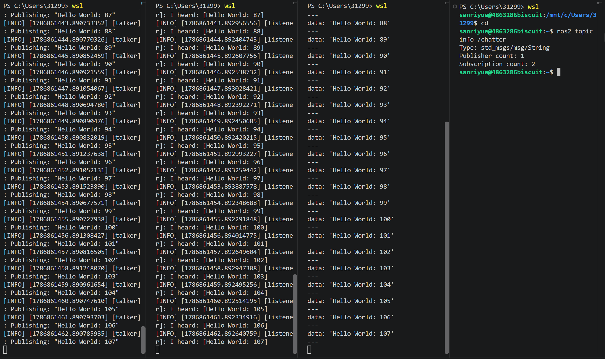

# W4 D1 实装+demo
## 装ros2的坑：
 1. URL 应该是 https://.../ubuntu/ + 空格 + noble main —— noble 是 suite，不是 URL；告诉 apt：从哪个服务器、拉取哪个 Ubuntu 版本、哪一类软件包。
 2. —Humble 命令不能直接抄到Jazzy 上用，至少 key 路径和源 URL 都要改。
 3. Jazzy 装环境时别再用任何镜像的 GPG key，直接从公钥服务器拿 F42ED6FBAB17C654 这个具体 key才是稳妥的
 4. gpg 命令时考虑 dirmngr 依赖
 5. sudo gpg 在 fresh WSL Ubuntu 上**/root/.gnupg 不存在**，dirmngr 启不来。
 6. Tsinghua Ubuntu 镜像对个别 deb 文件可能 403，已知不是用户配置问题，是镜像同步不完整。
 7. 清华 ROS2 镜像对部分包下载会失败
## D1学习成果：

- 4个问题：
 Q1. publisher 和 subscriber 谁先启动有关系吗？ —— 试：先 ros2 run demo_nodes_py listener（topic 还不存在），再开talker，listener 还能收到吗？
 A1：是否执行talker，listener都能运行。即使Talker是在listener之后，也可以收到
 Q2.ros2 topic echo /chatter 是另一个 subscriber 吗？ 它和 listener 在抢同一份消息还是各拿各的？—— 同时开两个 ros2 topic echo，输出一样还是各一份？
 A2：echo是另一个subscriber，各拿各的，各一份
 Q3. DDS 是什么？ 一句话理解（hint：ROS2 不用 master，它用什么协议让节点互相发现）
 A3：DDS 是 OMG 定义的通信中间件标准（类似 USB、HTTP 那种"标准协议"），ROS2 用它做节点自动发现和消息传输。DDS ≠ROS2，是 ROS2 的一个组件。让节点自动发现彼此，不需要 ROS1 那种 roscore master
 Q4.source /opt/ros/jazzy/setup.bash 做了什么？ 不 source 直接 ros2 ... 会怎样？
 A4：临时加载 ROS 2 Jazzy 的环境变量、路径、补全脚本，可在终端中自己配置文件让他自己启动，但是其他环境就需要source /opt/ros/jazzy/setup.bash
